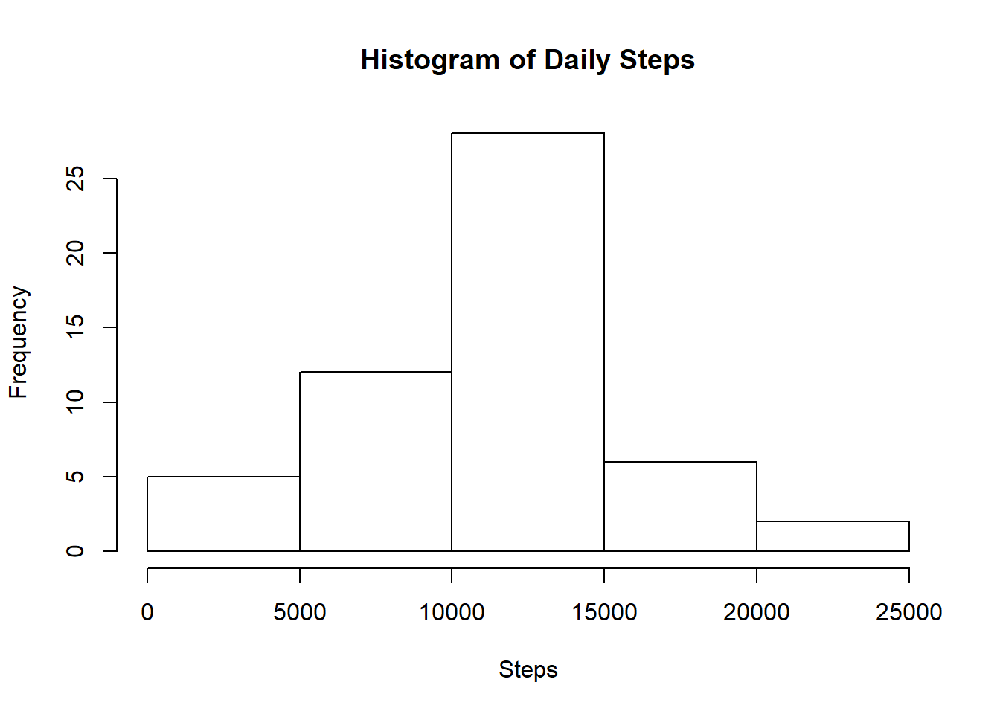
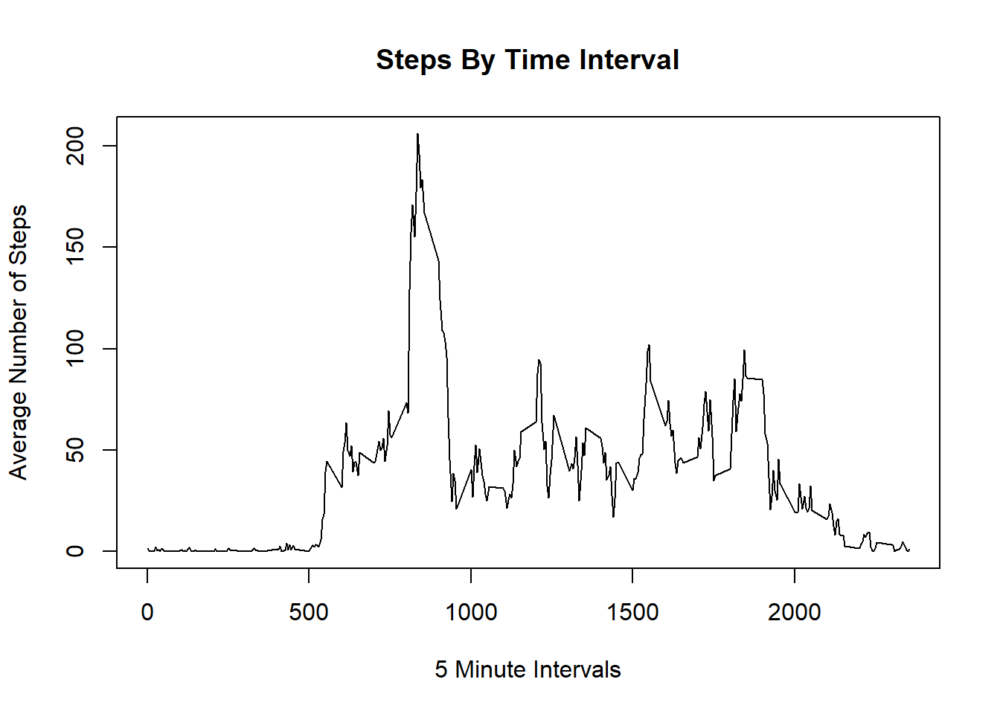

---
title: "Reproducible Research: Peer Assessment 1"
author: "Hong Chen"
Date: "March 6, 2020"
output: html_document
keep_md: true
----

## Loading and preprocessing the data


```r
  library(dplyr)
```

```
## 
## Attaching package: 'dplyr'
```

```
## The following objects are masked from 'package:stats':
## 
##     filter, lag
```

```
## The following objects are masked from 'package:base':
## 
##     intersect, setdiff, setequal, union
```

```r
  library(ggplot2)

  data<- read.csv(unzip("activity.zip"))
  names(data)
```

```
## [1] "steps"    "date"     "interval"
```

```r
  #head(data)
```


## What is mean total number of steps taken per day?

```r
  step_sum <- aggregate(steps~date, data, sum)
  head(step_sum)
```

```
##         date steps
## 1 2012-10-02   126
## 2 2012-10-03 11352
## 3 2012-10-04 12116
## 4 2012-10-05 13294
## 5 2012-10-06 15420
## 6 2012-10-07 11015
```

```r
  hist(step_sum$steps,main = "Histogram of Daily Steps", xlab="Steps", )
```

<!-- -->

```r
  step_mean <- mean(step_sum$steps)
  step_median <- median(step_sum$steps)
  print(paste("The mean is: ", step_mean))
```

```
## [1] "The mean is:  10766.1886792453"
```

```r
  print(paste("The median is: ", step_median))
```

```
## [1] "The median is:  10765"
```

## What is the average daily activity pattern?

```r
  step_interval <- aggregate(steps~interval, data, mean)
  head(step_interval)
```

```
##   interval     steps
## 1        0 1.7169811
## 2        5 0.3396226
## 3       10 0.1320755
## 4       15 0.1509434
## 5       20 0.0754717
## 6       25 2.0943396
```

```r
  plot(step_interval$steps ~ step_interval$interval,
     type="l", xlab = "5 Minute Intervals", ylab = "Average Number of Steps",
     main = "Steps By Time Interval")
```

<!-- -->

```r
  Max_steps_interval <- step_interval$interval[which.max(step_interval$steps)]
  print(paste("Interval containing the most steps on average: ",Max_steps_interval))
```

```
## [1] "Interval containing the most steps on average:  835"
```
  

## Imputing missing values

```r
  NA_sum <- sum(is.na(data$steps))
  print(paste("The total number of rows with NA is: ",NA_sum))
```

```
## [1] "The total number of rows with NA is:  2304"
```

```r
  new_data <- data  
  for (i in 1:nrow(data)){
        if(is.na(data$steps[i])){
                new_data$steps[i]<- step_interval$steps[new_data$interval[i] == step_interval$interval]
        }
  }
  head(new_data)
```

```
##       steps       date interval
## 1 1.7169811 2012-10-01        0
## 2 0.3396226 2012-10-01        5
## 3 0.1320755 2012-10-01       10
## 4 0.1509434 2012-10-01       15
## 5 0.0754717 2012-10-01       20
## 6 2.0943396 2012-10-01       25
```

```r
  new_step_sum <- aggregate(steps~date, new_data, sum)
  hist(new_step_sum$steps,main = "Histogram of Daily Steps", xlab="Steps", )
```

<!-- -->

```r
  new_step_mean <- mean(new_step_sum$steps)
  new_step_median <- median(new_step_sum$steps)
  print(paste("New mean is: ", new_step_mean))
```

```
## [1] "New mean is:  10766.1886792453"
```

```r
  print(paste("New median is: ", new_step_median))
```

```
## [1] "New median is:  10766.1886792453"
```
  

## Are there differences in activity patterns between weekdays and weekends?

```r
    new_data$days <- weekdays(as.Date(new_data$date))
    new_data$wdwn <- ifelse(new_data$days %in% c("Saturday", "Sunday"), "weekend", "weekday")
    head(new_data)
```

```
##       steps       date interval   days    wdwn
## 1 1.7169811 2012-10-01        0 Monday weekday
## 2 0.3396226 2012-10-01        5 Monday weekday
## 3 0.1320755 2012-10-01       10 Monday weekday
## 4 0.1509434 2012-10-01       15 Monday weekday
## 5 0.0754717 2012-10-01       20 Monday weekday
## 6 2.0943396 2012-10-01       25 Monday weekday
```

```r
    new_interval <- aggregate(steps~interval+wdwn, new_data, mean)
    
    ggplot(new_interval, aes(interval, steps)) +
    geom_line()+
    facet_grid(wdwn~.)
```

<!-- -->

```r
    #int_wkd <- filter(new_interval, wdwn=="weekday")
    #int_wked <- filter(new_interval, wdwn=="weekend")
    #par(mfrow=c(2,1))
    #qplot(interval, steps, data = int_wked)+geom_line()
    #qplot(interval, steps, data = int_wkd)+geom_line()
```
